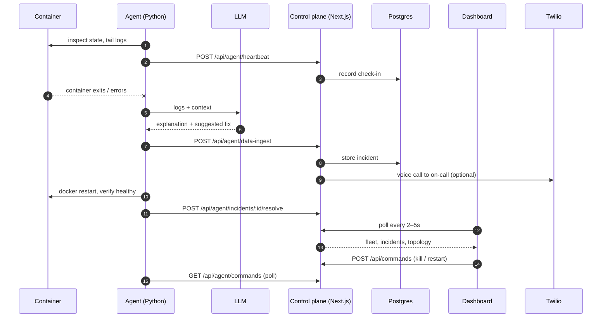
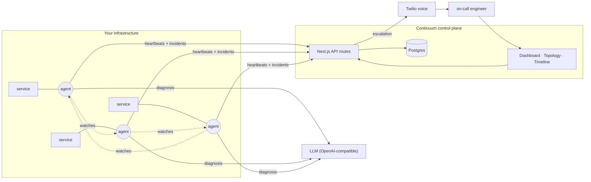

<p align="center">
  
</p>

<h1 align="center">Continuum</h1>

<p align="center"><strong>An autonomous AI SRE for containerized services.</strong><br />
It watches your containers, diagnoses failures with an LLM, and escalates to a human by voice when it can't resolve them itself.</p>

<p align="center">
  <a href="https://continuum.apak.ca">Live site</a> ·
  <a href="./docs/DEPLOYMENT.md">Deploy it</a> ·
  <a href="./agent">Run the agent</a>
</p>

<p align="center">
  
</p>

---

## What it does

- **Watches.** A lightweight Python agent runs beside your containers, tails their logs and state, and heartbeats to the control plane.
- **Diagnoses.** When a container fails, the agent sends the evidence to an LLM — any OpenAI-compatible endpoint — and gets back a plain-English explanation and a proposed fix, not a wall of logs.
- **Heals.** Crash-class failures are restarted, watched for a verification window, and the incident is closed by the agent with what it did. The proposed code fix is shown, not applied.
- **Escalates.** If a human needs to be in the loop, Continuum phones whoever is on the on-call roster with a spoken summary of the incident.
- **Shows you the mesh.** A live topology view draws every service, the agent watching it, and the agent watching *that* agent — so a dead watcher is itself noticed.

## Try it

**[continuum.apak.ca](https://continuum.apak.ca)** is the deployed control plane. The product is in private beta, so the landing page collects a waitlist; if you've been given an account, **Sign in** is in the header. Otherwise request access there or [run it locally](#running-it-locally) — the seed scripts give you a four-container fleet with ninety days of incident history in about a minute.

Once signed in, the thirty-second tour is **`/topology`**: pick a healthy service in the chaos panel, click *Inject fault*, and watch the loop the whole product is built around —

```
inject  →  detect  →  diagnose  →  heal
```

The node turns red on the live graph within two seconds, the agent's diagnosis and proposed fix appear as they're "produced", and the service heals. Against the seeded demo fleet this is a scripted simulation and labelled as one — no container is touched — but it writes the same rows a real agent would, so the incident lands on the timeline and the dashboard's mean-time-to-resolve moves for real.

**Run it for real.** With Docker installed, copy `agent/.env.example` to `agent/.env`, set the same `AGENT_TOKEN` as the app, and `docker compose up -d` in [`agent/`](./agent) starts a three-container demo app and an agent watching it. The chaos panel switches to **Live containers**: *Kill container* sends a real `kill` through the command queue, the agent sees the container die, files the incident with its diagnosis, restarts it, verifies it stays up, and closes the incident — every step on screen is something that actually happened. For a fault that comes from the application itself, open the demo app at `localhost:3001` and press **Trigger Crash**: its `/crash` endpoint divides by zero and exits the process, and the agent's diagnosis has a real traceback to work from. Without an LLM key the diagnosis says so and the loop still runs; with `LLM_*` set it's real. When you're done, `docker compose down` and `pnpm db:live-reset`. Every agent setting is documented in [`agent/.env.example`](./agent/.env.example).

<table>
  <tr>
    <td></td>
    <td></td>
  </tr>
  <tr>
    <td align="center"><sub>Detected — <code>agent-2</code> flags its service</sub></td>
    <td align="center"><sub>Healed — usage back, incident resolved</sub></td>
  </tr>
</table>

## How it works



The control plane is deliberately boring: Next.js route handlers in front of Postgres, polled by the UI. There is no long-lived socket to keep alive on serverless, and every screen re-derives its state from the database, which is what lets the chaos demo, the seed scripts, and a real agent all drive the same UI.

## Architecture



<p align="center">
  
</p>

**The mesh.** A running agent registers itself and the containers it watches, and the topology draws exactly that: real edges from each agent to its containers, coloured by health — a service by its latest check-in and open incidents, an agent by how recently it reported. The seeded demo fleet has no agent process, so the view derives one per container and wires them into a ring (each watching its service *and the next agent*), labelled "demo" so it is never mistaken for a live process. Commands from the UI reach an agent through a queue it polls, so agents never need an inbound port.

**Deployment.** The web app runs on Vercel; Postgres runs on Railway; agents run wherever your containers do (any host with Docker). See [DEPLOYMENT.md](./docs/DEPLOYMENT.md).

<p align="center">
  
</p>

## Stack

| Layer | Choice | Why |
| --- | --- | --- |
| Web | Next.js 15 (App Router), React 19, TypeScript | One codebase for UI and API; serverless-friendly |
| Styling | Tailwind v4 with a token-driven design system | Light and dark palettes from one set of semantic tokens |
| Auth | Clerk | Drop-in sessions and route protection |
| Data | Postgres via Drizzle ORM (`postgres-js`) | Typed schema, plain wire protocol — works with any provider |
| Agent | Python, the Docker CLI, any OpenAI-compatible LLM | One small process beside your containers; no inbound port, no provider lock-in |
| Escalation | Twilio | A phone call is the one alert nobody filters |
| Hosting | Vercel + Railway | Auto-deploys from `main`; always-on database |

## Running it locally

You need Node 20+, [pnpm](https://pnpm.io/installation), a Postgres connection string, and Clerk keys (free tier is fine).

```bash
pnpm install
cp .env.example .env        # fill in POSTGRES_URL and the two Clerk keys
pnpm db:push                # create the tables
pnpm db:seed-historical     # four containers, ninety days of incidents
pnpm db:seed-heartbeats     # check-ins, so the fleet reads as alive
pnpm dev                    # http://localhost:3000
```

All `db:*` scripts act on whatever database `POSTGRES_URL` points at. Before recording or demoing, `pnpm db:chaos-reset` puts the seeded fleet back to its starting state and `pnpm db:live-reset` forgets any previous live agent.

To run a real agent against your containers, see [`agent/`](./agent): set the same `AGENT_TOKEN` on both sides, point `AGENT_BACKEND_URL` at your control plane, and `docker compose up` brings up the agent alongside a three-container demo fleet to watch.

## Repository layout

```
src/app/            pages and API routes (App Router)
  dashboard/ topology/ servers/ timeline/ user/   the signed-in app (user = on-call roster)
  _components/      design-system primitives, charts, the topology graph, the chaos panel
  api/              agent ingest, commands, fleet, incidents, topology, chaos, waitlist
src/lib/            metrics, topology, command and status contracts, shared helpers
src/server/         database client, agent token auth, the command queue, chaos demo logic
src/scripts/        seed and reset scripts
agent/              the Python agent (register · heartbeat · commands · heal · LLM adapter), its Dockerfile, and a compose file with a demo fleet
docs/               deployment guide
```

## Roadmap

Continuum started as a hackathon project and the surface area is deliberately small. The things below are where the depth goes next, roughly in order:

- **Patch-apply with approval.** Today the agent heals by restart and proposes a code fix; next it applies that patch after a one-click approval, rebuilds, and rolls back if the service doesn't come up.
- **A real gossip mesh.** The ring is modelled and visualized now; the next step is agents that actually respawn a dead peer.
- **Stored watch relationships.** Agents are first-class rows now, and a live agent's edges to the containers it watches are real. The agent-watching-agent ring is still derived for display rather than stored, which is the piece a true multi-agent topology needs.
- **Container telemetry.** CPU and memory are synthesized until the agent reports `docker stats` with each heartbeat.
- **Narrated escalation calls.** ElevenLabs audio is generated today but Twilio still speaks the alert itself; serving the generated audio to the call is the missing piece.
- **Public status page** and moving the agent mesh onto always-on compute alongside the database.

## Origins

Continuum began as [HW12](https://github.com/sokosam/HW12), a 36-hour hackathon build, and this repository is its continuation — repositioned, redesigned, and rebuilt on a design system, a real deployment, and a live topology. The original is kept as a submodule at `original-hackathon-repo/` for the record.
