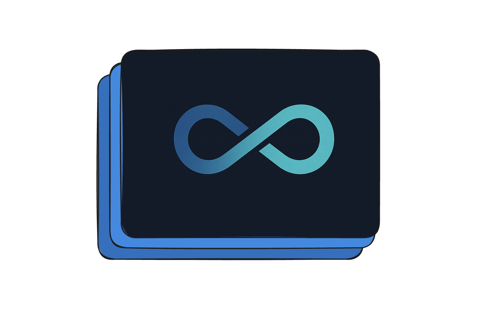
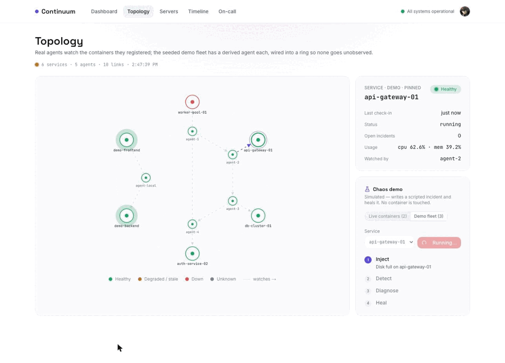
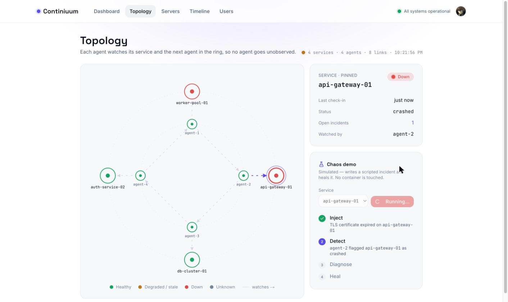
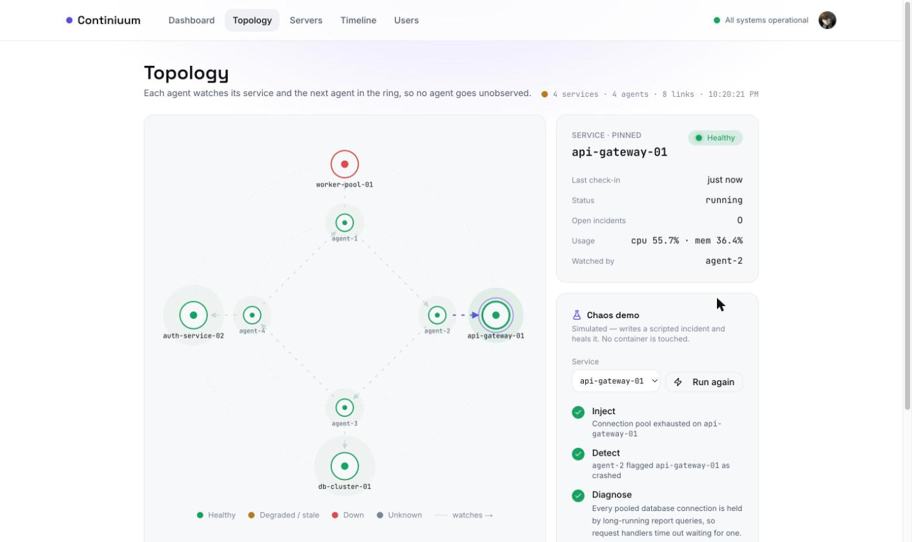
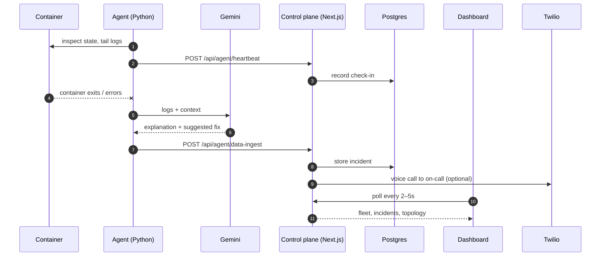
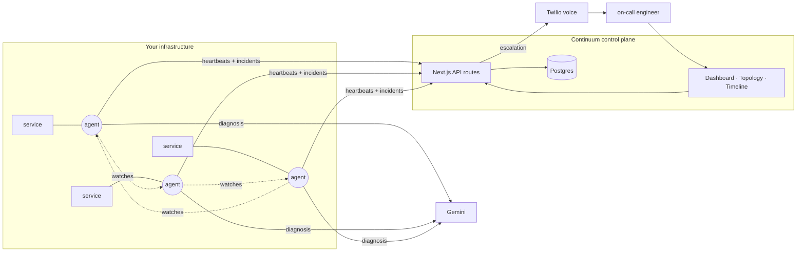
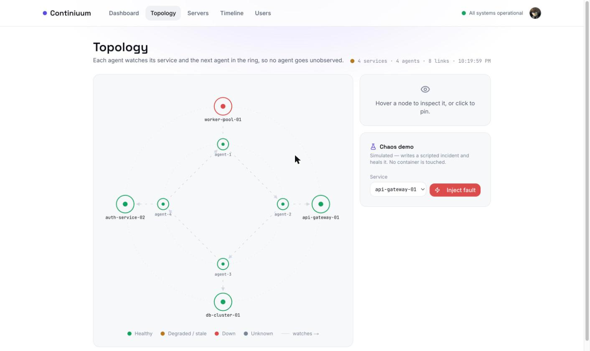
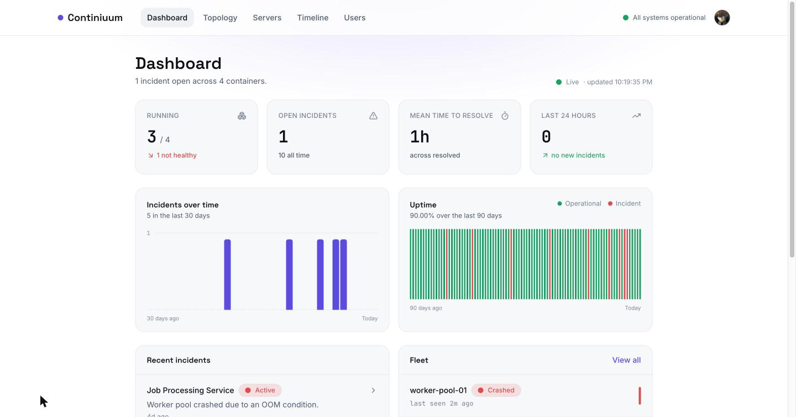

<p align="center">
  
</p>

<h1 align="center">Continuum</h1>

<p align="center"><strong>An autonomous AI SRE for containerized services.</strong><br />
It watches your containers, diagnoses failures with an LLM, and escalates to a human by voice when it can't resolve them itself.</p>

<p align="center">
  <a href="https://continuum.apak.ca">Live site</a> ·
  <a href="./docs/DEPLOYMENT.md">Deploy it</a> ·
  <a href="./docs/SCRIPTS.md">Scripts reference</a>
</p>

<p align="center">
  
</p>

---

## What it does

- **Watches.** A lightweight Python agent runs beside your containers, tails their logs and state, and heartbeats to the control plane.
- **Diagnoses.** When a container fails, the agent sends the evidence to Gemini and gets back a plain-English explanation and a proposed fix — not a wall of logs.
- **Escalates.** If a human needs to be in the loop, Continuum phones the on-call engineer with a spoken summary of the incident.
- **Shows you the mesh.** A live topology view draws every service, the agent watching it, and the agent watching *that* agent — so a dead watcher is itself noticed.

## Try it

**[continuum.apak.ca](https://continuum.apak.ca)** is the deployed control plane. The product is in private beta, so the landing page collects a waitlist; if you've been given an account, **Sign in** is in the header. Otherwise request access there or [run it locally](#running-it-locally) — the seed scripts give you a four-container fleet with ninety days of incident history in about a minute.

Once signed in, the thirty-second tour is **`/topology`**: pick a healthy service in the chaos panel, click *Inject fault*, and watch the loop the whole product is built around —

```
inject  →  detect  →  diagnose  →  heal
```

The node turns red on the live graph within two seconds, the agent's diagnosis and proposed fix appear as they're "produced", and the service heals. It's a scripted simulation and labelled as one — no container is touched — but it writes the same rows a real agent would, so the incident lands on the timeline and the dashboard's mean-time-to-resolve moves for real.

<table>
  <tr>
    <td></td>
    <td></td>
  </tr>
  <tr>
    <td align="center"><sub>Detected — <code>agent-2</code> flags its service</sub></td>
    <td align="center"><sub>Healed — usage back, incident resolved</sub></td>
  </tr>
</table>

## How it works



The control plane is deliberately boring: Next.js route handlers in front of Postgres, polled by the UI. There is no long-lived socket to keep alive on serverless, and every screen re-derives its state from the database, which is what lets the chaos demo, the seed scripts, and a real agent all drive the same UI.

## Architecture



<p align="center">
  
</p>

**The mesh.** Every service has an agent, and the agents form a ring: each one watches its own service *and the next agent*, so no agent is unobserved and there is no single supervisor to lose. The topology view derives this ring from the fleet and colours each node by health — a service by its latest check-in and open incidents, an agent by how recently it reported.

**Deployment.** The web app runs on Vercel; Postgres runs on Railway; agents run wherever your containers do (any host with Docker). See [DEPLOYMENT.md](./docs/DEPLOYMENT.md).

<p align="center">
  
</p>

## Stack

| Layer | Choice | Why |
| --- | --- | --- |
| Web | Next.js 15 (App Router), React 19, TypeScript | One codebase for UI and API; serverless-friendly |
| Styling | Tailwind v4 with a token-driven design system | Light and dark palettes from one set of semantic tokens |
| Auth | Clerk | Drop-in sessions and route protection |
| Data | Postgres via Drizzle ORM (`postgres-js`) | Typed schema, plain wire protocol — works with any provider |
| Agent | Python, Docker SDK, Gemini | Small enough to run beside every container |
| Escalation | Twilio | A phone call is the one alert nobody filters |
| Hosting | Vercel + Railway | Auto-deploys from `main`; always-on database |

## Running it locally

You need Node 20+, [pnpm](https://pnpm.io/installation), a Postgres connection string, and Clerk keys (free tier is fine).

```bash
pnpm install
cp .env.example .env        # fill in POSTGRES_URL and the two Clerk keys
pnpm db:push                # create the tables
pnpm db:seed-historical     # four containers, ninety days of incidents
pnpm db:seed-heartbeats     # check-ins, so the fleet reads as alive
pnpm dev                    # http://localhost:3000
```

Every script — what it does and which ones write to the database — is in [SCRIPTS.md](./docs/SCRIPTS.md). Before recording or demoing, `pnpm db:chaos-reset` puts the seeded fleet back to its starting state.

To run a real agent against your containers, see [`agent/`](./agent) and point `AGENT_BACKEND_URL` at your control plane.

## Repository layout

```
src/app/            pages and API routes (App Router)
  _components/      design-system primitives, charts, the topology graph, the chaos panel
  api/              agent ingest, fleet, incidents, topology, chaos, waitlist
src/lib/            metrics, topology and chaos contracts, shared helpers
src/server/         database client and chaos demo logic
src/scripts/        seed and reset scripts
agent/              the Python agent and its Dockerfile
docs/               deployment guide, scripts reference
```

## Roadmap

Continuum started as a hackathon project and the surface area is deliberately small. The things below are where the depth goes next, roughly in order:

- **Auto-remediation with rollback.** Today the agent proposes a fix; next it applies one with a guarded rollback and a one-click approval path.
- **A real gossip mesh.** The ring is modelled and visualized now; the next step is agents that actually respawn a dead peer.
- **First-class agents in the schema.** The topology is derived from the container list. Modelling agents and watch relationships explicitly unlocks arbitrary topologies and multi-target agents.
- **Container telemetry.** CPU and memory are synthesized until the agent reports `docker stats` with each heartbeat.
- **Narrated escalation calls.** ElevenLabs audio is generated today but Twilio still speaks the alert itself; serving the generated audio to the call is the missing piece.
- **Public status page** and moving the agent mesh onto always-on compute alongside the database.

## Origins

Continuum began as [HW12](https://github.com/sokosam/HW12), a 36-hour hackathon build, and this repository is its continuation — repositioned, redesigned, and rebuilt on a design system, a real deployment, and a live topology. The original is kept as a submodule at `original-hackathon-repo/` for the record.
